### Hey, I'm Divyarajsinh 👋

I turn messy ideas into useful, memorable software. I'm a software engineering student at the University of South Florida, building across AI, full-stack web, and creative interfaces.

[Explore my 3D portfolio](https://iamdk25.github.io/3d_personal_portfolio/) · [Connect on LinkedIn](https://www.linkedin.com/in/dkarmariya/) · [Browse my repositories](https://github.com/Iamdk25?tab=repositories)

---

### Selected work

| Project | What I built | Explore |
| :-- | :-- | :-- |
| **SkillSharp AI** | Mock interviews with AI-generated questions, speech input, and feedback. | [View code →](https://github.com/Iamdk25/skill-sharp-ai) |
| **EERIS** | A team-built expense and reimbursement tool with receipts, approval flows, and reports. | [View code →](https://github.com/deshninad/EERIS) |
| **3D Portfolio** | An interactive portfolio that makes exploring my work feel like exploring a space. | [Live site →](https://iamdk25.github.io/3d_personal_portfolio/) · [Code →](https://github.com/Iamdk25/3d_personal_portfolio) |

### What I work with

**Build:** React · Next.js · TypeScript · JavaScript · Node.js · Python · PostgreSQL  
**Explore:** AI-powered products · voice interfaces · 3D on the web · thoughtful UX

I like projects where the interface feels good **and** the underlying problem actually gets solved.

**Have an idea worth building?** [Let's connect →](https://www.linkedin.com/in/dkarmariya/)

